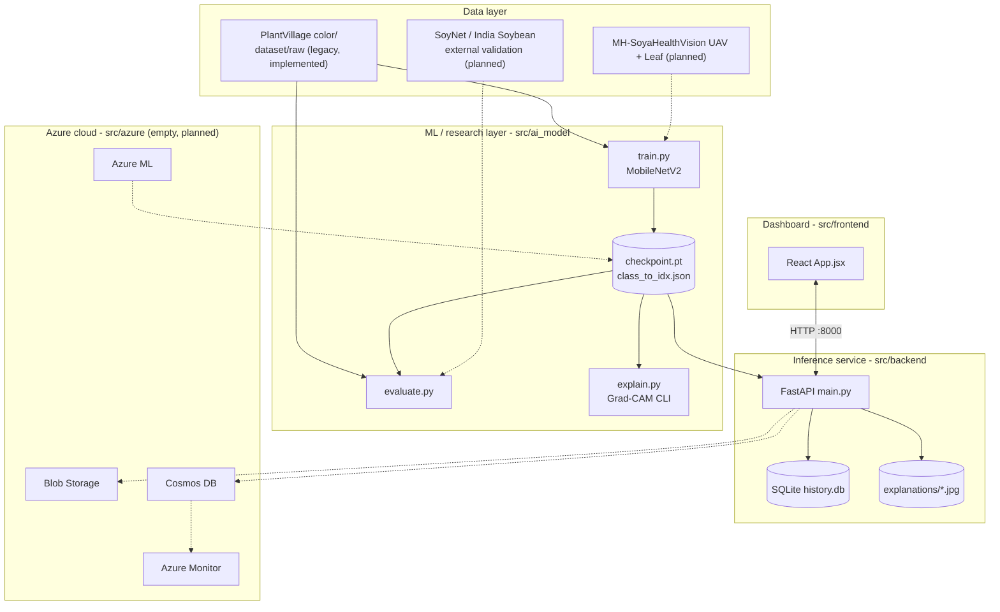
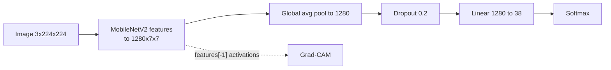
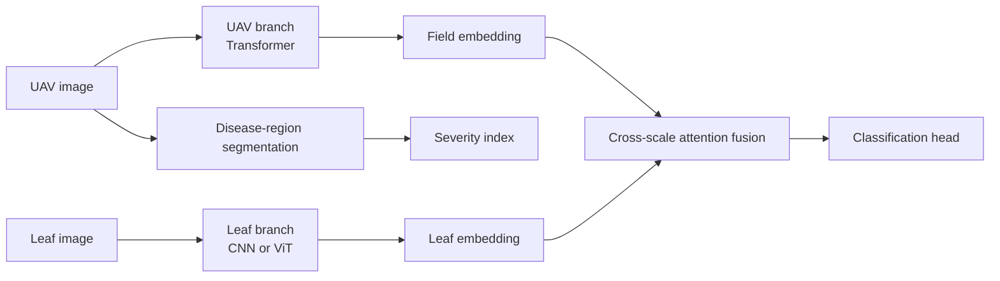
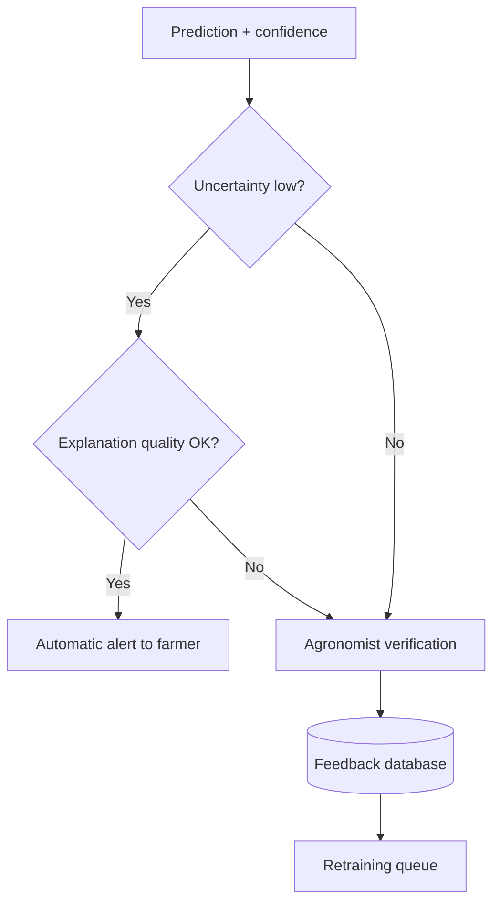
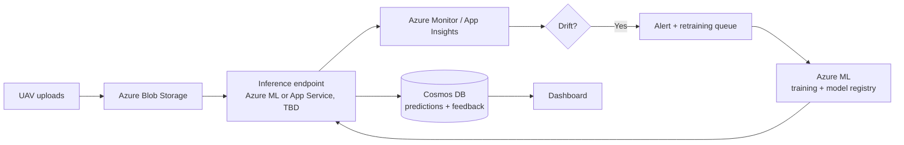
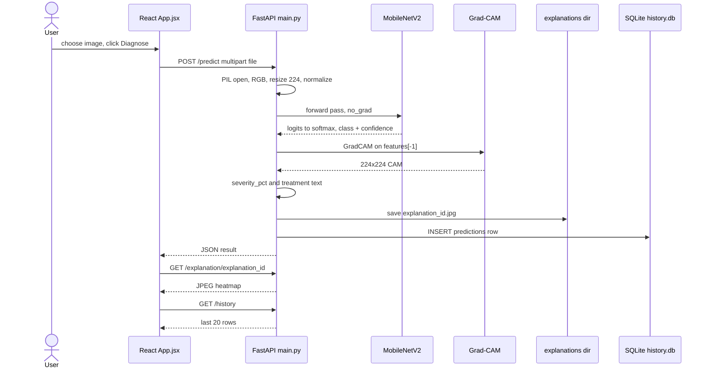
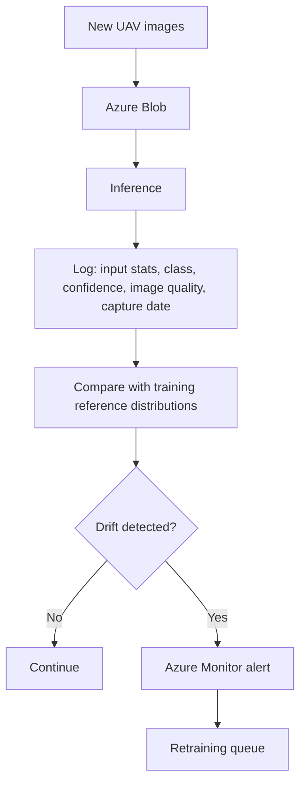

# Architecture

**Cross-Scale Explainable AI Cloud Framework for UAV-Based Crop Disease Detection, Severity Estimation and Field-Level Decision Support**

This document separates two things throughout:

- **As implemented**: what the code in this repository does today, with file references.
- **Target design (⏳ planned)**: what the project specification (Dr. Priya V) requires but the code does not yet contain. Planned items are never described as done.

Status markers: ✅ Implemented · 🟡 Partial · ⏳ Planned

---

## 1. Purpose & scope

**Goal (target):** diagnose soybean disease from UAV imagery, strengthened by leaf-level evidence (cross-scale diagnosis). Report an image-derived disease severity index, a quantified uncertainty and an evaluated explanation. Route uncertain cases to an agronomist, and monitor drift on Azure.

**As implemented:** a local, single-image leaf classifier demo.

| In scope today | Out of scope today (planned) |
|---|---|
| MobileNetV2 transfer learning on PlantVillage (38 classes) | MH-SoyaHealthVision UAV/Leaf data, SoyNet and India Soybean external validation |
| Grad-CAM heatmap per prediction | Grad-CAM++, Integrated Gradients, SHAP, quantitative XAI scoring |
| CAM-area "severity_pct" | Segmentation/superpixel severity, Low/Moderate/High thresholds |
| Keyword-based treatment text | Uncertainty estimation, decision logic, agronomist review |
| FastAPI + SQLite history + React UI, all local | Azure (Blob, Azure ML, Cosmos DB, Monitor), drift monitoring, retraining |

## 2. Design goals & principles

| Principle | Target meaning | Current state |
|---|---|---|
| Cross-scale diagnosis | Fuse a UAV canopy embedding with a leaf embedding, and prove it beats either alone | ⏳ Single-branch model only |
| Evaluated explainability | Heatmaps scored against disease masks, not just displayed | 🟡 Displayed only |
| Uncertainty-aware human-in-the-loop | Low uncertainty → auto alert. High uncertainty → agronomist → feedback → retraining | ⏳ |
| Robustness | Accuracy measured under field perturbations, improved by augmentation or domain adaptation | ⏳ |
| Cloud-native MLOps with drift monitoring | Azure-hosted inference, logged distributions, drift alerts, retraining queue | ⏳ Local only |
| Honest evaluation | Leakage-free splits, external validation | 🟡 [evaluate.py](src/ai_model/evaluate.py) flags PlantVillage leakage |

## 3. High-level architecture



Dashed edges are planned and absent from the code.

- **Data layer.** Only PlantVillage is wired in (`DATA_DIR = "../../dataset/raw/plantvillage_dataset/color"`). The project datasets are not referenced anywhere in the code.
- **ML layer.** Three standalone scripts that share one model definition (copy-pasted, not a shared module).
- **Inference service.** One FastAPI process. It loads the checkpoint at import time and stores history in SQLite and heatmaps on local disk.
- **Azure layer.** Not implemented. [src/azure/](src/azure/) contains only `.gitkeep`.
- **Dashboard.** A single React page with no user roles.

## 4. Component breakdown

### 4.1 `src/ai_model/train.py`: training (Modules: baseline for 1)
- **Responsibility:** fine-tune ImageNet MobileNetV2 on PlantVillage.
- **Inputs:** `ImageFolder` at `../../dataset/raw/plantvillage_dataset/color`.
- **Outputs:** `checkpoint.pt` (best `state_dict` by val accuracy) and `class_to_idx.json`.
- **Key code:** module-level data/model setup, `run_epoch(loader, train_mode)`, and a `__main__` loop.
- **Note:** data loading, model creation and `class_to_idx.json` writing run at **import time**, outside `__main__`.

### 4.2 `src/ai_model/evaluate.py`: evaluation (supports honest evaluation)
- **Responsibility:** rebuild a 15% validation split, print `sklearn.metrics.classification_report`, and list classes with precision = recall = 1.0 as a possible leakage signal.
- **Inputs:** same dataset path, `checkpoint.pt`, `class_to_idx.json`.
- **Outputs:** stdout only. Nothing is written to `results/`.
- `confusion_matrix` is imported but unused.

### 4.3 `src/ai_model/explain.py`: Grad-CAM CLI (Module 3, partial)
- **Responsibility:** `predict_and_explain(image_path, output_path="explanation.jpg")` → `(predicted_class, confidence, output_path)`.
- Uses `pytorch_grad_cam.GradCAM` on `model.features[-1]`, and overlays with `show_cam_on_image`.

### 4.4 `src/backend/main.py`: inference API (Modules 2, 3 partial; history store)
- **Responsibility:** serve predictions, heatmaps and history.
- **Functions:** `get_treatment_advice(class_name)`, `compute_severity(grayscale_cam, threshold=0.5)`, `init_db()`, plus the route handlers `health`, `predict`, `get_explanation` and `get_history`.
- **Dependencies:** FastAPI, torch/torchvision, grad-cam, Pillow, sqlite3 ([requirements.txt](src/backend/requirements.txt)).
- Reads the model from `../ai_model/checkpoint.pt`. It does not import the ai_model scripts; the model definition is duplicated.

### 4.5 `src/frontend/`: dashboard
- **Responsibility:** upload an image, show the prediction, confidence, severity bar, treatment and heatmap, and list recent diagnoses.
- **Key file:** [App.jsx](src/frontend/src/App.jsx) (`API_BASE = "http://127.0.0.1:8000"`). Styles are in [App.css](src/frontend/src/App.css).
- **Stack:** React 19, Vite 8, oxlint ([package.json](src/frontend/package.json)).

### 4.6 `src/azure/`: ⏳ empty placeholder.

## 5. Data architecture

### 5.1 Dataset roles

| Role | Dataset | Implemented? |
|---|---|---|
| Train / validate (UAV) | MH-SoyaHealthVision UAV | ⏳ |
| Train / validate (Leaf) | MH-SoyaHealthVision Leaf | ⏳ |
| External validation only | SoyNet (2026), India Soybean Dataset | ⏳ |
| Legacy bring-up (not a project dataset) | PlantVillage `color/` | ✅ currently the only data used |

### 5.2 Splits and leakage

- **As implemented:** an 85/15 `random_split` over the whole PlantVillage folder. There is no test set and no group-aware splitting.
- [train.py](src/ai_model/train.py) calls `random_split` **without a seed**. [evaluate.py](src/ai_model/evaluate.py) uses `seed 42` and claims to reproduce the training split. **It does not.** Its "validation" set therefore overlaps the training data. See [Known issues](#21-known-issues-limitations--future-work).
- PlantVillage contains near-duplicate images (several shots of the same leaf), so even a correct random split leaks. `evaluate.py` prints a warning to this effect.
- **Target:** seeded, saved splits on MH-SoyaHealthVision (ideally grouped by field or flight to avoid spatial leakage), with SoyNet and India Soybean held out entirely as external tests. The grouping strategy is TBD.

### 5.3 Preprocessing & augmentation (as implemented)

```python
transforms.Resize((224, 224))
transforms.ToTensor()
transforms.Normalize(mean=[0.485, 0.456, 0.406], std=[0.229, 0.224, 0.225])
```

Train, eval and inference all use this same pipeline. **There is no augmentation.**

### 5.4 UAV–Leaf pairing for fusion
⏳ Not implemented. No pairing strategy (class-level pairing, random same-class sampling, etc.) exists in the code. **TBD.**

### 5.5 Storage layout

| Store | Location | Contents |
|---|---|---|
| Raw data | `dataset/raw/` (git-ignored) | PlantVillage `ImageFolder` |
| Model artefacts | `src/ai_model/checkpoint.pt` (git-ignored), `src/ai_model/class_to_idx.json` (committed) | weights, class map |
| Heatmaps | `src/backend/explanations/{explanation_id}.jpg` (git-ignored) | Grad-CAM overlays |
| Prediction log | `src/backend/history.db` (git-ignored) | SQLite table `predictions` |
| Azure Blob containers | ⏳ | — |
| Cosmos DB | ⏳ | — |

**SQLite schema** (`init_db()` in [main.py](src/backend/main.py)):

```sql
CREATE TABLE IF NOT EXISTS predictions (
    id TEXT PRIMARY KEY,          -- uuid4
    timestamp TEXT NOT NULL,      -- ISO-8601 UTC
    filename TEXT,                -- original upload name
    predicted_class TEXT NOT NULL,
    confidence REAL NOT NULL,     -- top-1 softmax
    severity_pct REAL NOT NULL,   -- CAM-area %, see section 7
    explanation_id TEXT NOT NULL  -- uuid4 of heatmap file
);
```

The `treatment` text is returned to the client but **not stored**. There is no feedback table and no Cosmos DB schema yet.

## 6. Model architecture

### 6.1 As implemented: single-branch classifier

| Item | Value | Source |
|---|---|---|
| Backbone | `torchvision.models.mobilenet_v2`, `IMAGENET1K_V2` weights | train.py |
| Head | `model.classifier[1] = nn.Linear(1280, 38)` (dropout 0.2 from torchvision default kept) | train.py |
| Input | 3×224×224 RGB, ImageNet normalized | train.py |
| Classes | 38 PlantVillage classes ([class_to_idx.json](src/ai_model/class_to_idx.json)) | — |
| Loss | `nn.CrossEntropyLoss()` | train.py |
| Optimizer | Adam, lr 1e-4, all layers trainable | train.py |
| Epochs / batch | 5 / 32 | train.py |
| Device | `mps` if available, else `cpu` (CUDA is never selected) | all scripts |
| Checkpoint rule | save when val accuracy improves | train.py |



### 6.2 Target: cross-scale model (⏳ planned, not in code)



Backbones, embedding sizes, fusion design, segmentation model, losses and training schedule are **TBD**. None can be determined from the code. Required baselines: UAV-only, Leaf-only, CNN, CNN-Transformer, CNN-Transformer + XAI.

### 6.3 Uncertainty method
⏳ None. Only the top-1 softmax probability is reported, with no MC Dropout, ensembles, temperature scaling or entropy.

## 7. Severity estimation

**As implemented (🟡):** `compute_severity()` in [main.py](src/backend/main.py)

```python
activated_fraction = float((grayscale_cam >= 0.5).mean())
severity_pct = round(activated_fraction * 100, 1)
```

- This is the share of the **224×224 Grad-CAM map** at or above 0.5. It is computed on the whole image, not on a leaf or canopy mask.
- It measures the model's attention spread, **not diseased area**. A healthy-leaf prediction still produces a non-zero value.
- The backend returns **no Low/Moderate/High label**. The frontend only colours the bar: `< 15` green, `< 40` yellow, otherwise red (`severityColor` in [App.jsx](src/frontend/src/App.jsx)).

**Target (⏳):** UAV disease-region segmentation or superpixel processing → affected-region % → Low/Moderate/High (thresholds TBD) → output like `Affected region: 18.6% · Severity: Moderate`.

> Both the current and target measures are an **image-derived disease severity index**. Neither is expert or ground-truth severity: the repo contains no agronomist-provided severity scores.

## 8. Explainability (XAI) subsystem

| Method | Status | Where |
|---|---|---|
| Grad-CAM | ✅ generation | [explain.py](src/ai_model/explain.py), [main.py](src/backend/main.py). Target layer `model.features[-1]` |
| Grad-CAM++ | ⏳ | (available in the installed `grad-cam` package, but not used) |
| Integrated Gradients | ⏳ | — |
| SHAP | ⏳ | `shap==0.52.0` is in [ai_model/requirements.txt](src/ai_model/requirements.txt) but never imported |

- **Heatmap generation:** a new `GradCAM(model, [features[-1]])` is built per request. The CAM targets the predicted class (no explicit target, which defaults to argmax). The result is overlaid on the resized RGB image with `show_cam_on_image(..., use_rgb=True)` and saved as JPEG.
- **Scoring against masks** (IoU, pointing accuracy, localization score): ⏳ not implemented, and no disease masks exist in the repo.
- **Explanation quality → decision:** ⏳ not implemented.

## 9. Uncertainty & decision logic

**As implemented:** no decision logic. Every prediction is returned and logged the same way, with no threshold on confidence.

**Target (⏳). Thresholds are TBD and none exist in code:**



## 10. Robustness evaluation framework

⏳ Not implemented. No perturbation code, no augmentation, no domain adaptation.

Planned perturbation set (parameters TBD): brightness variation, shadows, haze, blur, JPEG compression, rotation, partial occlusion and colour shift. Procedure: accuracy per perturbation vs clean images, before and after augmentation or domain adaptation.

## 11. Cloud architecture (Azure)

**As implemented:** none. No Bicep/ARM/Terraform, Azure ML job specs, Function apps, SDK imports, connection strings or Key Vault references exist in the repo. Everything runs on localhost.

**Target (⏳), from the project specification:**



Hosting choice, resource names, auth, networking and secrets management are **TBD**.

## 12. Request lifecycle

**As implemented** (`POST /predict`):



The target lifecycle adds an optional leaf image, uncertainty, XAI scoring, a Cosmos DB write and agronomist review with stored feedback. All of these are ⏳.

## 13. Feedback loop & retraining
⏳ Not implemented. There is no feedback endpoint, no feedback table, no review UI and no retraining trigger. `train.py` is run manually.

## 14. Drift monitoring
⏳ Not implemented. Each inference logs only `timestamp, filename, predicted_class, confidence, severity_pct` to SQLite. That is enough to compute class and confidence distributions later, but no drift code exists.

Target flow (metrics and thresholds TBD):



| Drift type | Candidate metric (spec) | Implemented |
|---|---|---|
| Input distribution | TBD (e.g. embedding / pixel statistics) | ⏳ |
| Class distribution | TBD | ⏳ |
| Confidence | TBD | ⏳ |
| Seasonal | TBD | ⏳ |
| Image quality | TBD | ⏳ |

## 15. API specification

Base URL: `http://127.0.0.1:8000` (uvicorn default). FastAPI title: `"Crop Disease XAI API"`. Interactive docs are at `/docs` (FastAPI default). CORS allows only `http://localhost:5173`. There is no authentication.

### `GET /health`
```json
{"status": "ok"}
```

### `POST /predict`
- **Body:** `multipart/form-data`, field `file` (image). Any format PIL can open.
- **200 response:**
```json
{
  "id": "uuid4",
  "timestamp": "2026-01-01T00:00:00+00:00",
  "predicted_class": "Tomato___Late_blight",
  "confidence": 0.0,
  "severity_pct": 0.0,
  "treatment": "string",
  "explanation_id": "uuid4",
  "explanation_url": "/explanation/<explanation_id>"
}
```
(The values above illustrate the schema only.) `confidence` is rounded to 4 decimals, and `severity_pct` to 1 decimal in the 0–100 range.
- **Errors:** `422` if `file` is missing (FastAPI validation). A non-image upload raises an unhandled PIL error, which returns **500**. There is no explicit error handling.

### `GET /explanation/{explanation_id}`
- **200:** `image/jpeg` heatmap.
- **Unknown id:** no existence check. `FileResponse` on a missing file gives a server error rather than a clean 404.

### `GET /history`
- **Query:** `limit` (int, default 20).
- **200:** an array of rows, newest first:
```json
[{"id": "...", "timestamp": "...", "filename": "...", "predicted_class": "...",
  "confidence": 0.0, "severity_pct": 0.0, "explanation_id": "..."}]
```

## 16. Dashboard

**As implemented:** one page ([App.jsx](src/frontend/src/App.jsx)) with no routing and no roles.

| Area | Shows |
|---|---|
| "Diagnose a Leaf" card | File picker + preview, Diagnose button, then the result: class name (with `___` and `_` prettified), confidence %, coloured severity bar + %, "Recommended action" text and the Grad-CAM heatmap |
| "Recent Diagnoses" card | `/history` list: class, confidence, severity %, local timestamp |

**Target (⏳):** separate farmer view (alerts, severity, advice) and agronomist view (review queue for high-uncertainty cases, feedback submission, drift status).

## 17. Experiment design

All ⏳. The planned design from the specification:

- **Baselines:** UAV-only, Leaf-only, CNN, CNN-Transformer, CNN-Transformer + XAI, and the proposed cross-scale model.
- **Ablations:** fusion vs no fusion; with vs without augmentation or domain adaptation (robustness).
- **Metrics:** accuracy, F1, XAI localization (IoU, pointing accuracy), confidence/uncertainty calibration, accuracy under each perturbation, and drift metrics.
- **External validation:** train and validate on MH-SoyaHealthVision, then test on SoyNet and the India Soybean Dataset with an explicit label-mapping table (TBD), never mixing them into training.

The only experiment in code is the PlantVillage MobileNetV2 baseline plus a leakage check. Its metrics are not saved to `results/`.

## 18. Configuration

There are no config files or environment variables. Everything is a module-level constant:

| File | Constant | Value |
|---|---|---|
| train.py | `DATA_DIR` | `../../dataset/raw/plantvillage_dataset/color` |
| train.py | `BATCH_SIZE`, `EPOCHS`, `LR`, `IMG_SIZE` | 32, 5, 1e-4, 224 |
| train.py / evaluate.py / explain.py | `CHECKPOINT_PATH`, `CLASS_MAP_PATH` | `checkpoint.pt`, `class_to_idx.json` (relative to cwd) |
| evaluate.py | split seed | 42 (val fraction 0.15, batch 32) |
| main.py | `AI_MODEL_DIR` | `../ai_model` |
| main.py | `OUTPUT_DIR`, `DB_PATH` | `explanations`, `history.db` |
| main.py | `compute_severity` threshold | 0.5 |
| main.py | CORS `allow_origins` | `["http://localhost:5173"]` |
| App.jsx | `API_BASE` | `http://127.0.0.1:8000` |
| App.jsx | severity colour cut-offs | 15, 40 |

Environment variables: **none** (no `.env`, no `os.environ` reads).

## 19. Deployment

- **Local (✅):** `uvicorn main:app --reload` from `src/backend/`, and `npm run dev` from `src/frontend/`. A trained `src/ai_model/checkpoint.pt` must exist first, because it is git-ignored and not distributed.
- **Docker:** ⏳ no Dockerfile or compose file.
- **Azure:** ⏳ nothing.
- **CI/CD:** ⏳ no workflows. The frontend has an `npm run lint` (oxlint) script.

## 20. Security & privacy

- **Secrets:** none are used, so none are stored. Future Azure credentials should go in Key Vault or environment variables, never in the repo.
- **Access control:** none. The API is unauthenticated, but CORS restricts browser origins to localhost:5173 (CORS does not restrict non-browser clients).
- **Input handling:** no file size or type limits on `/predict`. `explanation_id` is interpolated into a file path without validation (path params cannot contain `/`, which limits but does not formally validate this).
- **Data retention:** uploaded images are not stored. Heatmaps and the original filenames are kept indefinitely.
- **Licensing:** MH-SoyaHealthVision and the India Soybean Dataset are CC BY 4.0, so attribution is required (see README). Check SoyNet's license on its Mendeley page before redistribution (not recorded in the repo).

## 21. Known issues, limitations & future work

**Inconsistencies found in the code**

1. **Split mismatch / leakage in evaluation.** [train.py:36](src/ai_model/train.py#L36) uses an unseeded `random_split`. [evaluate.py:29-34](src/ai_model/evaluate.py#L29-L34) uses seed 42 and its comment claims it is the "SAME held-out val split". It is not, so the evaluation set overlaps the training data and the reported metrics are inflated.
2. **Dataset contradicts the specification.** All training and evaluation code is hard-wired to PlantVillage (38 multi-crop classes; the only soybean class is `Soybean___healthy`). None of the MH-SoyaHealthVision classes (Mosaic, Rust, Septoria brown spot, Frogeye leaf spot, Caterpillar/Semi-looper pest) exist in [class_to_idx.json](src/ai_model/class_to_idx.json).
3. **Unreachable treatment branch.** In `get_treatment_advice`, the `"spot"` check runs before `"bacterial"`. As a result, all three `*___Bacterial_spot` classes (Peach, Pepper, Tomato) get fungicide advice, and the bactericide branch is never reached. `Grape___Esca_(Black_Measles)` and `Strawberry___Leaf_scorch` fall through to the generic advice. The `"huanglongbing"` keyword never matches the dataset's misspelt `Haunglongbing`, but `"greening"` catches that class.
4. **"Severity" is CAM area,** not disease area, and has no Low/Moderate/High labels server-side. The colour thresholds exist only in the frontend.
5. **Model definition duplicated** in 4 files (train, evaluate, explain, main) with no shared module.
6. **Side effects at import time.** `train.py` loads the dataset and overwrites `class_to_idx.json` when imported. `main.py` loads the model at import time.
7. **No CUDA support.** The device is `mps` or `cpu` only.
8. **Unused dependencies.** `shap` and `pandas` in [ai_model/requirements.txt](src/ai_model/requirements.txt), and `confusion_matrix` in evaluate.py.
9. **Version drift between environments.** `numpy==2.4.6` (ai_model) vs `numpy==2.5.1` (backend), and `tqdm` 4.69.1 vs 4.70.0.
10. **Missing error handling.** No 404 for unknown explanation ids, no 400 for non-image uploads.
11. **Leftover template files.** [src/frontend/README.md](src/frontend/README.md) is the Vite template, `index.html` has the title "frontend", `index.css` contains template styles (e.g. `#social`), and `hero.png`, `react.svg` and `vite.svg` are unused.
12. **Old title in the README.** The previous README used the title "Explainable AI Cloud Platform for Precision Crop Disease Diagnosis using Drone Imagery", which the UI header still echoes. It differs from the supervisor's title.
13. **No results recorded.** The "val_acc 0.9955" appears only in a commit message (`1728957`).

**Future work:** see the README [Roadmap](README.md#roadmap).

## 22. Module traceability matrix

| Module | Implementing files | Status | How it is (or will be) evaluated |
|---|---|---|---|
| 1. Cross-scale UAV + Leaf learning | — (single-branch baseline only: [train.py](src/ai_model/train.py)) | ⏳ | Accuracy/F1 vs UAV-only and Leaf-only baselines on MH-SoyaHealthVision, plus external validation on SoyNet / India Soybean |
| 2. Image-derived severity index | [main.py](src/backend/main.py) `compute_severity` (CAM-area proxy), [App.jsx](src/frontend/src/App.jsx) colour bands | 🟡 | Not evaluated. Target: segmentation-based affected-area %, Low/Moderate/High |
| 3. Evaluated XAI | [explain.py](src/ai_model/explain.py), [main.py](src/backend/main.py) (Grad-CAM only) | 🟡 | Not evaluated. Target: IoU, pointing accuracy and localization score vs disease masks for Grad-CAM, Grad-CAM++, IG and SHAP |
| 4. Uncertainty-aware diagnosis | — | ⏳ | Target: calibration, auto-accept vs review rates and error rate in each |
| 5. Robustness | — | ⏳ | Target: accuracy per perturbation vs clean, with and without augmentation |
| 6. Azure drift monitoring | — ([src/azure/](src/azure/) empty; SQLite log in main.py) | ⏳ | Target: drift metrics per type, alert latency, retraining trigger |
| (support) Leakage-aware evaluation | [evaluate.py](src/ai_model/evaluate.py) | 🟡 | Perfect-class count. Undermined by the split-seed mismatch (issue 1) |
