# Architecture

**Cross-Scale Explainable AI Cloud Framework for UAV-Based Crop Disease Detection, Severity Estimation and Field-Level Decision Support**

This document describes how the system is designed: its layers, components, data flow, models, decision logic and Azure cloud architecture. For an overview and setup instructions, see [README.md](README.md).

---

## Table of Contents

1. [Purpose and Scope](#1-purpose-and-scope)
2. [Design Principles](#2-design-principles)
3. [High-Level Architecture](#3-high-level-architecture)
4. [Data Architecture](#4-data-architecture)
5. [Model Architecture — Cross-Scale Learning (Module 1)](#5-model-architecture--cross-scale-learning-module-1)
6. [Severity Estimation (Module 2)](#6-severity-estimation-module-2)
7. [Explainability Subsystem (Module 3)](#7-explainability-subsystem-module-3)
8. [Uncertainty and Decision Logic (Module 4)](#8-uncertainty-and-decision-logic-module-4)
9. [Robustness Evaluation Framework (Module 5)](#9-robustness-evaluation-framework-module-5)
10. [Cloud Architecture on Azure](#10-cloud-architecture-on-azure)
11. [Drift Monitoring (Module 6)](#11-drift-monitoring-module-6)
12. [Request Lifecycle](#12-request-lifecycle)
13. [Feedback Loop and Retraining](#13-feedback-loop-and-retraining)
14. [Dashboard](#14-dashboard)
15. [Experiment Design](#15-experiment-design)
16. [Security and Data Licensing](#16-security-and-data-licensing)
17. [Limitations and Future Work](#17-limitations-and-future-work)
18. [Module Traceability Matrix](#18-module-traceability-matrix)

---

## 1. Purpose and Scope

### Purpose
To diagnose soybean diseases from UAV imagery by combining **field-level (macro)** and **leaf-level (micro)** evidence. For each diagnosis the system:

- predicts the disease class
- localizes the diseased regions
- estimates severity (as an image-derived disease severity index)
- quantifies uncertainty
- explains the decision and measures how good that explanation is
- delivers the result through an Azure cloud API to a farmer/agronomist dashboard

### In scope
- Cross-scale UAV + leaf disease recognition
- Disease-region segmentation and severity estimation
- Quantitative XAI evaluation
- Uncertainty-aware decisions with human-in-the-loop review
- Robustness testing under simulated field conditions
- Cloud inference, storage, monitoring, drift detection and a retraining queue on Azure

### Out of scope
- Expert (agronomist-graded) ground-truth severity labels. Severity is image-derived.
- Treatment or pesticide recommendations
- Real-time on-drone (edge) inference

### Research question
> Can combining macro-level UAV evidence with micro-level leaf evidence improve disease recognition and explanation compared with either modality alone?

---

## 2. Design Principles

| Principle | How it shows up in the architecture |
|---|---|
| **Cross-scale diagnosis** | Separate UAV and leaf branches, joined by cross-scale attention fusion |
| **Beyond classification** | Each output includes affected-area %, a severity level, uncertainty and an explanation |
| **Evaluated, not decorative, XAI** | Heatmaps are scored against disease masks (IoU, pointing accuracy, localization score) |
| **Human-in-the-loop** | High-uncertainty predictions go to agronomists; their verdicts are stored for retraining |
| **Robust to the field** | A perturbation suite plus augmentation / domain adaptation |
| **Cloud as research contribution** | Drift monitoring and the retraining queue are part of the evaluated system, not just hosting |
| **Honest methodology** | Severity is named "image-derived disease severity index"; external datasets are used only for validation |

---

## 3. High-Level Architecture

The system has five layers.

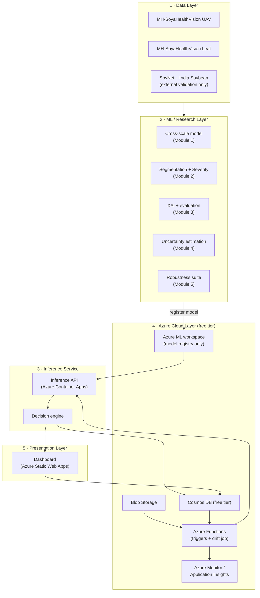

| Layer | Responsibility |
|---|---|
| **Data** | Dataset acquisition, preprocessing, splits, augmentation |
| **ML / Research** | Training and evaluating the cross-scale model, segmentation, XAI, uncertainty and robustness |
| **Inference service** | Serves predictions and applies the accept / review decision rules |
| **Azure cloud** | Storage, event triggers, model registry, prediction/feedback database, monitoring and drift alerts — all within Azure free-tier limits (see §10) |
| **Presentation** | Dashboard for farmers (alerts) and agronomists (review and feedback) |

---

## 4. Data Architecture

### 4.1 Dataset roles

| Role | Dataset | Used for |
|---|---|---|
| Main UAV training | **MH-SoyaHealthVision — UAV** (DJI Mini 4 Pro, real field conditions) | UAV classification, field-level diagnosis, disease-region segmentation, Grad-CAM/XAI, severity estimation, cloud inference |
| Ground-level learning | **MH-SoyaHealthVision — Leaf** (~2,835 images) | Leaf branch of the cross-scale model |
| External validation | **SoyNet** (29,000+ images) | Generalization testing only |
| Additional external validation | **India Soybean Dataset** (3,363 images) | Generalization testing only (labels don't map perfectly to UAV classes) |
| Not used as main dataset | PlantVillage | — |

**Leaf classes:** Healthy, Mosaic, Rust, Septoria brown spot, Frogeye leaf spot, Caterpillar / Semi-looper pest.

### 4.2 Data flow

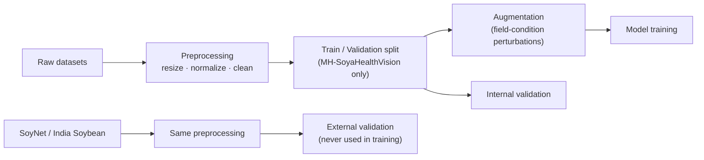

### 4.3 Data integrity rules
- External datasets are **never mixed** into training or internal validation.
- Splits are fixed with a recorded random seed so experiments are reproducible.
- Labels from the India Soybean Dataset are mapped to the project's classes only where a clear match exists. Unmatched classes are reported separately.

### 4.4 Storage layout

**Local / repository**
```
data/
├── mh_soyahealthvision/
│   ├── uav/
│   └── leaf/
├── soynet/            # external validation only
└── india_soybean/     # external validation only
```

**Azure Blob Storage (containers)**

| Container | Contents |
|---|---|
| `incoming-uav` | New UAV images uploaded for inference |
| `incoming-leaf` | Optional leaf images uploaded alongside UAV images |
| `xai-outputs` | Generated heatmaps and severity overlays |
| `verified-samples` | Agronomist-verified images for retraining |

> To stay inside the 5 GB free Blob allowance, the full training datasets stay **local** (or on Colab/Drive). Only incoming images, XAI outputs and verified samples go to Blob. Images are resized/compressed before upload, and old XAI outputs are removed by a lifecycle rule.

**Cosmos DB — NoSQL API, free-tier account (containers)**

| Container | Stores |
|---|---|
| `predictions` | One record per inference (see schema below) |
| `feedback` | Agronomist verdicts for reviewed predictions |
| `drift_stats` | Aggregated statistics per monitoring window |
| `retraining_queue` | Retraining requests raised by drift alerts or new feedback |

> All four containers share one database with **shared throughput of 1,000 RU/s**, which keeps the whole account inside the free tier.

Example `predictions` document:

```json
{
  "id": "pred_000123",
  "timestamp": "2026-10-03T10:15:00Z",
  "field_id": "field_07",
  "image_uri": "incoming-uav/field_07/img_0412.jpg",
  "model_version": "cross-scale-v1",
  "disease": "Soybean Rust",
  "confidence": 0.94,
  "affected_region_percent": 18.6,
  "severity_index": "Moderate",
  "uncertainty": "Low",
  "explanation_quality": "High",
  "xai_uri": "xai-outputs/pred_000123.png",
  "decision": "Automatically accepted",
  "review_status": "not_required"
}
```

---

## 5. Model Architecture — Cross-Scale Learning (Module 1)

### 5.1 Two perspectives
- **Macro (UAV) branch:** What does the entire crop canopy / field look like?
- **Micro (leaf) branch:** What does the actual diseased leaf look like?

### 5.2 Architecture

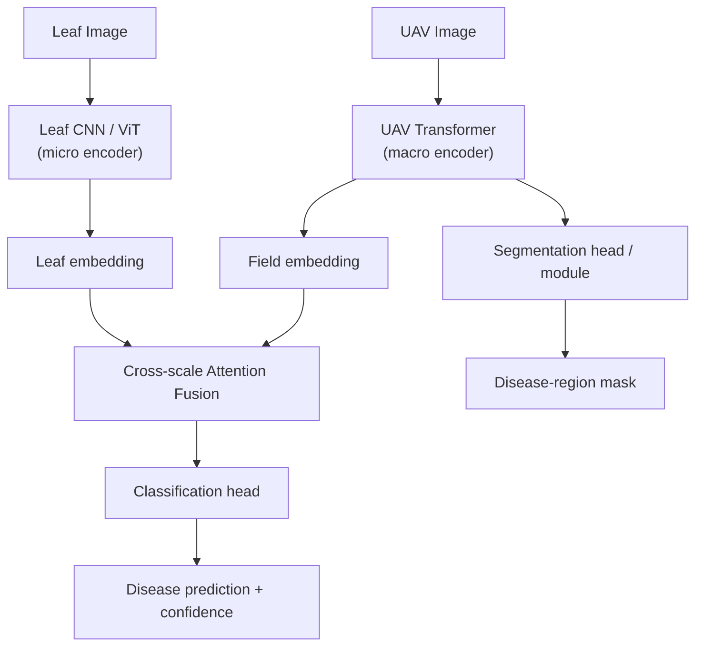

| Component | Role |
|---|---|
| **UAV Transformer** | Encodes the whole UAV frame into a field embedding, capturing canopy-level patterns and spatial spread |
| **Leaf CNN / ViT** | Encodes leaf images into a leaf embedding, capturing fine lesion texture, color and shape |
| **Cross-scale attention fusion** | Lets each scale attend to the other (field ↔ leaf), producing a joint representation |
| **Classification head** | Outputs class probabilities over the disease classes |
| **Segmentation module** | Localizes disease regions in the UAV image, which feeds severity estimation and XAI evaluation |

### 5.3 Pairing strategy
UAV and leaf images are not captured as one-to-one pairs. During training, each UAV sample is paired with leaf samples **of the same disease class**, so the fusion module learns class-consistent cross-scale relationships. At inference, a leaf image is used when available. Otherwise the model runs in UAV-only mode.

### 5.4 Baselines and ablations
- UAV-only model
- Leaf-only model
- CNN
- CNN-Transformer
- CNN-Transformer + XAI
- **Proposed cross-scale fusion model**

---

## 6. Severity Estimation (Module 2)

### 6.1 Pipeline

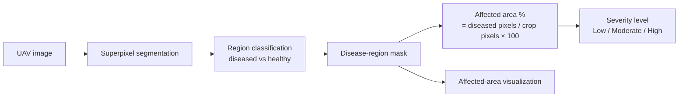

This follows the MH-SoyaHealthVision approach to UAV disease-region segmentation with superpixel-based processing.

### 6.2 Output

```
Disease:                Soybean Rust
Confidence:             94%
Affected region:        18.6%
Severity:               Moderate
Affected-area visual:   ██████░░░░
```

### 6.3 Severity levels
The affected-area percentage is mapped to **Low / Moderate / High** using thresholds defined in the project configuration. The thresholds are recorded with each model version so results stay reproducible.

> **Methodology note:** Because severity comes from segmentation masks, it is called the **image-derived disease severity index**. It is not called ground-truth or expert severity, since no agronomist-graded severity scores are used.

---

## 7. Explainability Subsystem (Module 3)

### 7.1 Methods

| Method | Type |
|---|---|
| Grad-CAM | Gradient-weighted class activation map |
| Grad-CAM++ | Improved CAM with better multi-instance localization |
| Integrated Gradients | Path-integrated attribution |
| SHAP | Shapley-value attribution |

### 7.2 Quantitative evaluation

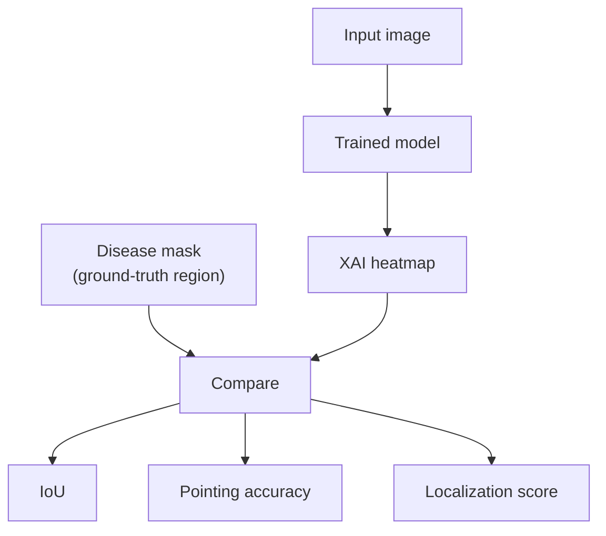

| Metric | Definition |
|---|---|
| **IoU** | Overlap between the thresholded heatmap and the disease mask |
| **Pointing accuracy** | Share of images where the heatmap's peak falls inside the disease mask |
| **Localization score** | Share of heatmap energy that falls inside the disease mask |

### 7.3 Explanation quality in production
At inference time, explanation quality is estimated from how concentrated the heatmap is within the predicted disease region. It is labeled **High** or **Low** and passed to the decision engine (Section 8).

---

## 8. Uncertainty and Decision Logic (Module 4)

### 8.1 Signals per prediction

| Signal | Source |
|---|---|
| Confidence | Softmax probability of the predicted class |
| Uncertainty | Model uncertainty estimate (e.g. Monte Carlo dropout variance or predictive entropy) |
| Explanation quality | From the XAI subsystem (Section 7.3) |

### 8.2 Decision rules

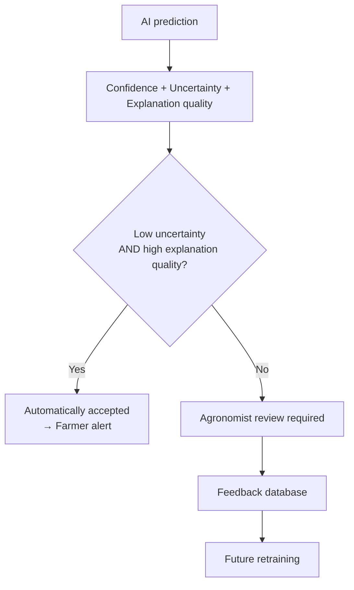

| Case | Confidence | Uncertainty | Explanation quality | Decision |
|---|---|---|---|---|
| A | 94% | Low | High | Automatically accepted |
| B | 61% | High | Low | Agronomist review required |

The confidence and uncertainty thresholds are set in configuration and calibrated on the validation set.

---

## 9. Robustness Evaluation Framework (Module 5)

### 9.1 Perturbations

| Perturbation | Simulates |
|---|---|
| Brightness variation | Time of day, cloud cover |
| Shadows | Clouds, drone shadow, canopy shading |
| Haze | Atmospheric haze, dust |
| Blur | Motion blur, defocus |
| JPEG compression | Transmission / storage compression |
| Rotation | Drone heading changes |
| Partial occlusion | Overlapping leaves, debris, frame edges |
| Color shift | Camera white balance, sensor differences |

### 9.2 Procedure

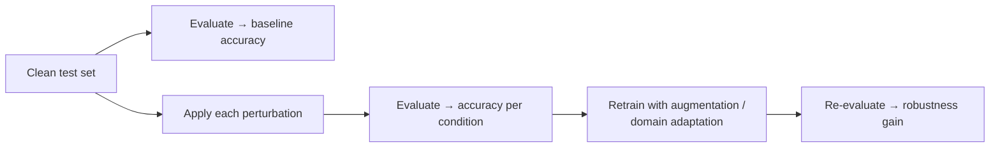

---

## 10. Cloud Architecture on Azure

The cloud layer uses **only services that have a free tier on an Azure free account**. Model training runs outside Azure (local GPU or Google Colab), because Azure ML compute is billed and is not part of the free tier.

### 10.1 Service map

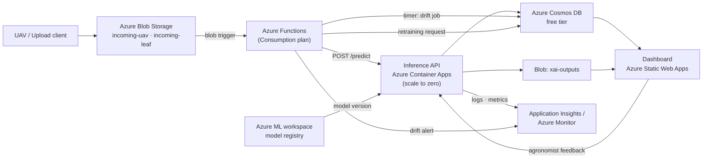

### 10.2 Free-tier services used

| Service | Role in this project | Free allowance (Azure free account) |
|---|---|---|
| **Azure Blob Storage** | Incoming UAV/leaf images, XAI heatmaps, verified samples | 5 GB LRS hot blob storage + 20K reads / 10K writes per month (12 months) |
| **Azure Functions** (Consumption plan) | Blob trigger that starts inference; timer-triggered drift job; writes retraining requests | 1 million executions + 400,000 GB-s per month (always free) |
| **Azure Container Apps** (Consumption) | Hosts the PyTorch inference API as a container; scales to zero when idle | 180,000 vCPU-s + 360,000 GiB-s + 2 million requests per month (always free) |
| **Azure Cosmos DB** (free tier, NoSQL API) | `predictions`, `feedback`, `drift_stats`, `retraining_queue` | 1,000 RU/s + 25 GB storage (always free, one account per subscription) |
| **Azure Static Web Apps** (Free plan) | Farmer / agronomist dashboard | 100 GB bandwidth, 0.5 GB storage per app (always free) |
| **Azure Monitor / Application Insights** | API logs, request metrics, drift metrics, alerts | 5 GB log ingestion per month, 31-day retention (always free) |
| **Azure Machine Learning** (workspace only) | Model registry and experiment tracking; no paid compute used | Workspace is free; only compute is billed, and none is used |

### 10.3 Free-tier design decisions

| Decision | Why |
|---|---|
| Train locally / on Colab, not on Azure ML compute | Azure ML compute instances and clusters are billed |
| Inference on **Container Apps** instead of an Azure ML managed endpoint | Managed endpoints run on billed VMs; Container Apps has a monthly free grant and scales to zero |
| **Functions** for event-driven glue (blob trigger, drift timer) | 1M free executions covers all triggers and scheduled jobs |
| **Cosmos DB** container as the retraining queue | Avoids adding a separate queue/messaging service |
| Shared 1,000 RU/s database throughput | Keeps every Cosmos DB container under the free-tier limit |
| Only incoming images and outputs in Blob, not full datasets | Stays inside the 5 GB free storage |
| Secrets in app settings / environment variables | Keeps the design to free services only |
| Container image in GitHub Container Registry | Azure Container Registry is free only for 12 months |

> **Cost safety:** Set an Azure **budget alert** (Cost Management, free) at a small amount so you're notified before any charge. Enable free tier when creating the Cosmos DB account, because it cannot be switched on later.

### 10.4 API endpoints

| Method | Endpoint | Purpose |
|---|---|---|
| `POST` | `/predict` | Submit a UAV image (and optional leaf image); returns a full diagnosis |
| `GET` | `/predictions/{id}` | Fetch a stored prediction and its XAI output |
| `GET` | `/predictions?status=review` | List predictions waiting for agronomist review |
| `POST` | `/feedback` | Submit an agronomist verdict for a prediction |
| `GET` | `/drift` | Current drift metrics and alert status |
| `GET` | `/health` | Service health check |

**`POST /predict` response**

```json
{
  "prediction_id": "pred_000123",
  "disease": "Soybean Rust",
  "confidence": 0.94,
  "affected_region_percent": 18.6,
  "severity_index": "Moderate",
  "severity_type": "image-derived disease severity index",
  "uncertainty": "Low",
  "explanation_quality": "High",
  "xai_method": "Grad-CAM++",
  "xai_heatmap_url": "https://<storage>/xai-outputs/pred_000123.png",
  "decision": "Automatically accepted"
}
```

---

## 11. Drift Monitoring (Module 6)

Because this is a cloud computing project, drift monitoring makes the Azure layer part of the research contribution.

### 11.1 Flow

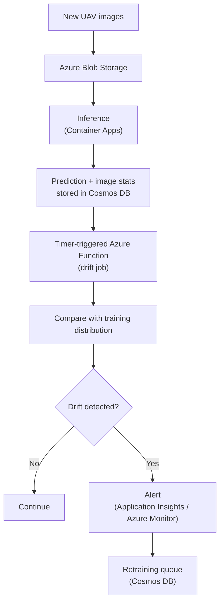

### 11.2 Drift types and signals

| Drift type | Signal monitored | Reference |
|---|---|---|
| **Input distribution drift** | Image embedding / feature statistics | Training-set feature distribution |
| **Class distribution drift** | Predicted class frequencies | Training-set class frequencies |
| **Confidence drift** | Distribution of confidence scores | Validation-set confidence distribution |
| **Seasonal drift** | Metrics grouped by season / growth stage | Earlier seasons |
| **Image-quality drift** | Brightness, contrast, blur, noise statistics | Training-set image-quality profile |

The reference distributions are computed once after training and saved with the registered model. The drift Function runs on a schedule (for example daily), reads recent records from Cosmos DB, computes statistical distances (for example PSI, KL / JS divergence or KS tests) over a rolling window and writes the result to `drift_stats`. When a threshold is crossed, it logs a custom event to Application Insights, which fires an Azure Monitor alert, and adds an entry to `retraining_queue`.

---

## 12. Request Lifecycle

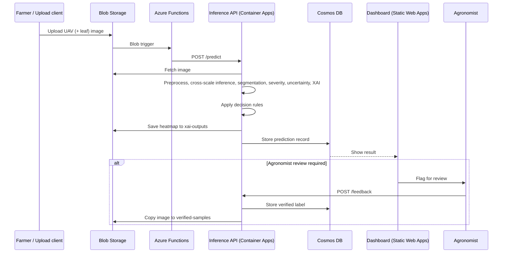

---

## 13. Feedback Loop and Retraining

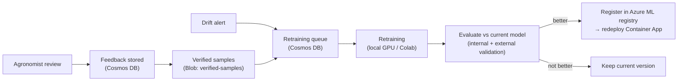

- Only agronomist-verified samples are added to the training data.
- Retraining is run outside Azure to avoid billed compute. The retraining queue records **when** and **why** retraining is needed.
- A new model version replaces the current one only if it performs better on internal **and** external validation.
- Every prediction records the `model_version` that produced it.

---

## 14. Dashboard

| View | User | Shows |
|---|---|---|
| **Field overview** | Farmer | Fields, latest diagnoses, severity levels, alerts |
| **Diagnosis detail** | Farmer / Agronomist | Disease, confidence, affected %, severity bar, XAI heatmap overlay |
| **Review queue** | Agronomist | High-uncertainty predictions waiting for verification |
| **Feedback form** | Agronomist | Confirm or correct the label, add notes |
| **Model health** | Agronomist / Admin | Drift metrics, alert history, active model version |

---

## 15. Experiment Design

| Experiment | Compares | Metrics |
|---|---|---|
| **Cross-scale ablation** | UAV-only vs Leaf-only vs UAV + Leaf fusion | Accuracy, F1, XAI localization |
| **Model comparison** | CNN · CNN-Transformer · CNN-Transformer + XAI · Proposed | Accuracy, F1, XAI localization, confidence |
| **XAI comparison** | Grad-CAM · Grad-CAM++ · Integrated Gradients · SHAP | IoU, pointing accuracy, localization score |
| **Robustness** | Clean vs each perturbation, before/after augmentation | Accuracy per condition |
| **External validation** | MH-SoyaHealthVision vs SoyNet vs India Soybean | Accuracy, F1 |
| **Drift monitoring** | Simulated / real shifts vs training reference | Drift scores, alert correctness |

**Validation protocol**

```
Training:              MH-SoyaHealthVision
Validation:            MH-SoyaHealthVision
External validation:   SoyNet  (+ India Soybean Dataset)
```

---

## 16. Security and Data Licensing

- **Secrets:** Azure connection strings and keys are kept in Container Apps / Functions / Static Web Apps application settings (environment variables) and never committed.
- **Access control:** Separate roles for farmers (view own fields) and agronomists (review and feedback).
- **Data in transit:** All API and storage traffic uses HTTPS.
- **Licensing:** MH-SoyaHealthVision, SoyNet and the India Soybean Dataset are CC BY 4.0. Attribution is kept in the README and any publications.

---

## 17. Limitations and Future Work

| Limitation | Mitigation / future work |
|---|---|
| Severity is image-derived, not expert-graded | Collect agronomist severity scores to validate the index |
| UAV and leaf images are not true one-to-one pairs | Capture paired field data (UAV pass + ground leaf samples of the same plot) |
| External dataset labels don't fully match | Report matched classes separately; expand the label mapping |
| Field-condition drift | Ongoing drift monitoring plus retraining from verified feedback |
| Free-tier limits (5 GB Blob, 1,000 RU/s, Container Apps free grant) | Fine for a research prototype; production-scale use would need paid tiers |
| Depends on agronomist availability | Prioritize the review queue by severity and uncertainty |

---

## 18. Module Traceability Matrix

| Module | Architecture sections | Suggested code location | Evaluated by |
|---|---|---|---|
| **1 — Cross-scale UAV + leaf learning** | §5 | `src/models/` | Cross-scale ablation, model comparison |
| **2 — Severity estimation** | §6 | `src/severity/` | Affected-area accuracy vs masks |
| **3 — Evaluated XAI** | §7 | `src/xai/` | IoU, pointing accuracy, localization score |
| **4 — Uncertainty-aware diagnosis** | §8 | `src/uncertainty/` | Calibration, review-routing accuracy |
| **5 — Robustness** | §9 | `src/robustness/` | Accuracy under perturbations, before/after augmentation |
| **6 — Drift monitoring** | §10, §11, §13 | `src/drift/`, `cloud/functions/` | Drift detection, alert correctness |