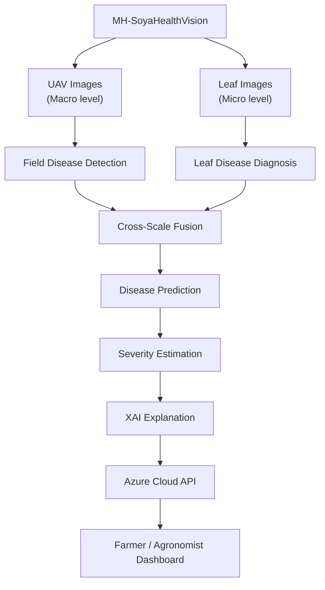
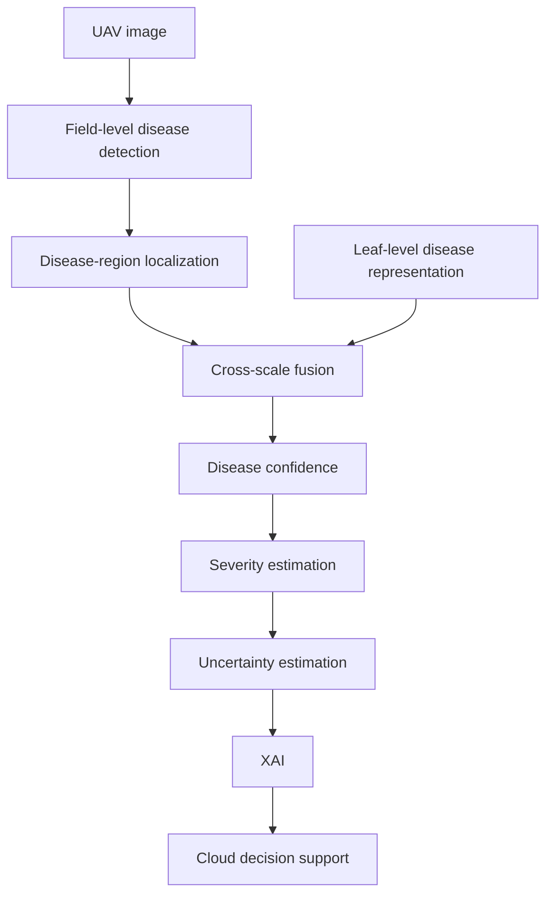
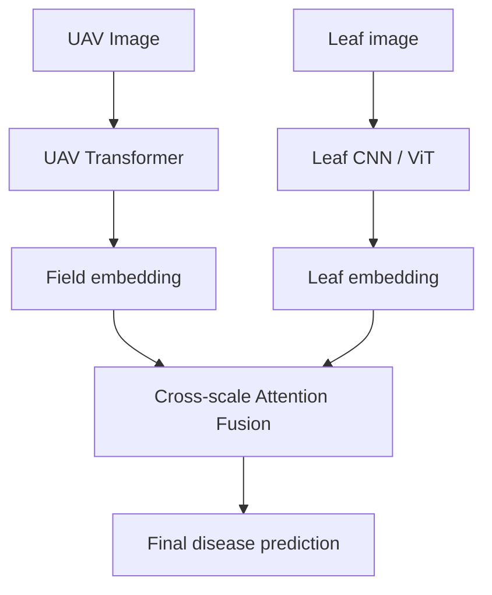
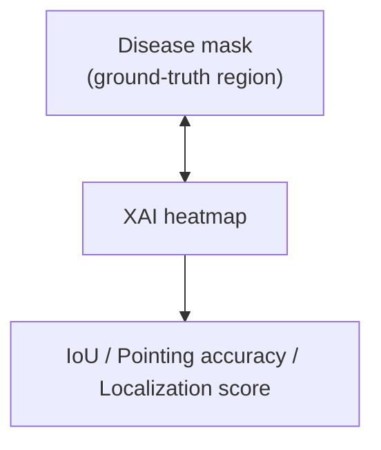
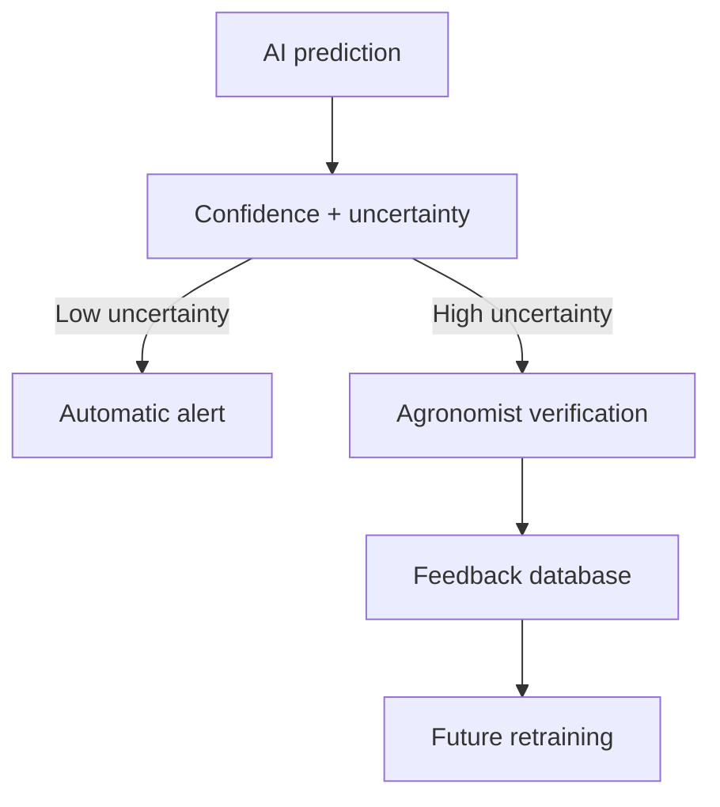
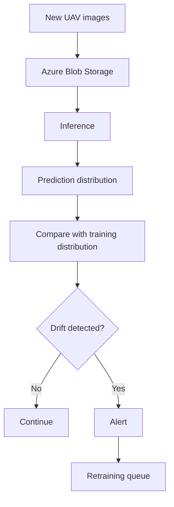

# Cross-Scale Explainable AI Cloud Framework for UAV-Based Crop Disease Detection, Severity Estimation and Field-Level Decision Support

> A two-scale (UAV + leaf) deep learning framework for soybean disease diagnosis that estimates disease severity, quantifies prediction uncertainty, evaluates its own explanations, and runs as a cloud-native decision-support service on Microsoft Azure with drift monitoring and an agronomist feedback loop.

---

## Table of Contents

- [Overview](#overview)
- [Research Question](#research-question)
- [Key Contributions](#key-contributions)
- [System Architecture](#system-architecture)
- [Datasets](#datasets)
- [Modules](#modules)
  - [Module 1 — Cross-Scale UAV + Leaf Learning](#module-1--cross-scale-uav--leaf-learning)
  - [Module 2 — Disease Severity Estimation](#module-2--disease-severity-estimation)
  - [Module 3 — Evaluated Explainable AI (XAI)](#module-3--evaluated-explainable-ai-xai)
  - [Module 4 — Uncertainty-Aware Diagnosis](#module-4--uncertainty-aware-diagnosis)
  - [Module 5 — Robustness Against Field Conditions](#module-5--robustness-against-field-conditions)
  - [Module 6 — Cloud-Side Model Drift Monitoring](#module-6--cloud-side-model-drift-monitoring)
- [Evaluation Protocol](#evaluation-protocol)
- [Example Output](#example-output)
- [Azure Cloud Stack](#azure-cloud-stack)
- [Repository Structure](#repository-structure)
- [Getting Started](#getting-started)
- [Limitations](#limitations)
- [Acknowledgements](#acknowledgements)
- [References](#references)
- [License](#license)

---

## Overview

Most UAV crop-disease systems follow a single path:

```
UAV image → CNN → Disease
```

This project replaces that with a **cross-scale diagnostic pipeline**. It combines what the whole crop canopy looks like from the air (**macro view**) with what an individual diseased leaf looks like up close (**micro view**). It then goes beyond a class label and a confidence score to give:

- **where** the disease is (disease-region localization)
- **how much** of the field is affected (image-derived severity index)
- **how sure** the model is (uncertainty estimation)
- **why** it decided (quantitatively evaluated XAI)
- **what to do next** (auto-alert, or route to an agronomist for review)

All of this is served through an Azure cloud API to a farmer/agronomist dashboard. The cloud layer also monitors model drift and queues retraining.

UAV imagery, CNN-Transformer models, Grad-CAM/SHAP, Azure and automated pipelines are useful system components, but on their own they are not strong novelty claims. This project's contribution is **cross-scale diagnosis**, together with **evaluated** (not just displayed) explainability, **uncertainty-aware** decisions, **robustness** testing and **cloud-side drift monitoring** as part of the research.

---

## Research Question

> **Can combining macro-level UAV evidence with micro-level leaf evidence improve disease recognition and explanation compared with either modality alone?**

This is tested by comparing UAV-only, leaf-only and fused (cross-scale) models on accuracy, F1, XAI localization quality and confidence calibration.

---

## Key Contributions

| # | Contribution | What it adds |
|---|---|---|
| 1 | **Cross-scale UAV + leaf learning** | Fuses field-level (UAV) and leaf-level representations with cross-scale attention |
| 2 | **Disease severity estimation** | Reports affected-area % and Low / Moderate / High severity, not just a class label |
| 3 | **Evaluated XAI** | Compares Grad-CAM, Grad-CAM++, Integrated Gradients and SHAP against disease masks (IoU, pointing accuracy) |
| 4 | **Uncertainty-aware diagnosis** | Confident predictions are auto-accepted; uncertain ones are routed to an agronomist |
| 5 | **Robustness to field conditions** | Measures accuracy under lighting, shadow, haze, blur, compression, rotation, occlusion and color shifts |
| 6 | **Cloud-side drift monitoring** | Azure-based detection of input, class, confidence, seasonal and image-quality drift, with a retraining queue |

---

## System Architecture

### Two-scale design



### End-to-end diagnostic pipeline



---

## Datasets

PlantVillage is deliberately **not** used as the main dataset. Its lab-style images don't reflect real field conditions.

| Purpose | Dataset | Details | Link |
|---|---|---|---|
| **Main UAV training** | **MH-SoyaHealthVision — UAV** | UAV field images captured with a DJI Mini 4 Pro under real agricultural conditions (varying lighting, backgrounds and crop growth stages). CC BY 4.0. | [Mendeley Data](https://data.mendeley.com/datasets/hkbgh5s3b7/1) |
| **Ground-level learning** | **MH-SoyaHealthVision — Leaf** | ~2,835 ground-level leaf images from the same dataset. | [Paper (PMC)](https://pmc.ncbi.nlm.nih.gov/articles/PMC12175242/) |
| **External validation** | **SoyNet** (2026 version) | 29,000+ soybean field images under different lighting and backgrounds. Used **only** for external validation, never mixed into training. | [Mendeley Data](https://data.mendeley.com/datasets/w2r855hpx8/3) |
| **Additional external validation** | **India Soybean Dataset** (Kotwal & Kashyap) | 3,363 images across healthy and disease/insect categories, including vein necrosis, dry leaf, Septoria brown spot and bacterial leaf blight. CC BY 4.0. Labels don't map perfectly to the UAV classes, so it is used for generalization testing only. | [Mendeley Data](https://data.mendeley.com/datasets/bshkvgbzpt/1) |
| ~~Main dataset~~ | ~~PlantVillage~~ | Avoided as the main dataset. | — |

### Dataset A — UAV level (MH-SoyaHealthVision UAV)

Used for:
- UAV disease classification
- Field-level diagnosis
- Disease-region segmentation
- Grad-CAM / XAI
- Severity estimation
- Cloud inference

### Dataset B — Ground / leaf level (MH-SoyaHealthVision Leaf)

Leaf classes:

| Class |
|---|
| Healthy |
| Mosaic |
| Rust |
| Septoria brown spot |
| Frogeye leaf spot |
| Caterpillar / Semi-looper pest |

---

## Modules

### Module 1 — Cross-Scale UAV + Leaf Learning

The system learns from two perspectives and combines them:

- **Macro perspective:** What does the entire crop canopy / field look like?
- **Micro perspective:** What does the actual diseased leaf look like?



**Experiment:** UAV-only vs leaf-only vs cross-scale fusion. This directly tests the research question.

---

### Module 2 — Disease Severity Estimation

Instead of only reporting `Rust = 94%`, the system reports:

```
Disease:                Soybean Rust
Confidence:             94%
Affected region:        18.6%
Severity:               Low / Moderate / High
Affected-area visual:   ██████░░░░
```

Affected regions come from **UAV disease-region segmentation** with **superpixel-based processing**, following the MH-SoyaHealthVision work.

> **Methodology note:** Severity values derived from segmentation masks are reported as an **image-derived disease severity index**. They are **not** expert-provided ground-truth severity labels. That term would only apply if actual agronomist severity scores were obtained.

---

### Module 3 — Evaluated Explainable AI (XAI)

Showing a heatmap is not enough. This project **measures** whether explanations focus on disease-relevant regions.

**Methods compared:**
- Grad-CAM
- Grad-CAM++
- Integrated Gradients
- SHAP

**Evaluation:**



This turns the claim from *"here is a pretty heatmap"* into *"we quantitatively evaluated whether the explanation focuses on disease-relevant regions."*

---

### Module 4 — Uncertainty-Aware Diagnosis

Each prediction carries confidence, uncertainty and explanation quality, and these drive an automatic decision.

**Low uncertainty: auto-accepted**
```
Prediction:          Rust
Confidence:          94%
Uncertainty:         Low
Explanation quality: High
Decision:            Automatically accepted
```

**High uncertainty: routed for review**
```
Prediction:          Rust
Confidence:          61%
Uncertainty:         High
Explanation quality: Low
Decision:            Agronomist review required
```

**Cloud decision workflow:**



---

### Module 5 — Robustness Against Field Conditions

Lighting and field-condition drift are a known unresolved issue for UAV disease models. Robustness is tested with controlled perturbations:

| Perturbation |
|---|
| Brightness variation |
| Shadows |
| Haze |
| Blur |
| JPEG compression |
| Rotation |
| Partial occlusion |
| Color shift |

**Procedure:**

```
Original UAV image  → Disease = Rust → Accuracy = X%
Shadow image        → Disease = Rust → Accuracy = Y%
Brightness shift    → Disease = Rust → Accuracy = Z%
```

Augmentation / domain adaptation is then added, and the tests are rerun to show whether robustness improves.

---

### Module 6 — Cloud-Side Model Drift Monitoring

This is a **cloud computing** project, so the Azure layer is part of the research contribution, not just infrastructure. The architecture uses Azure Blob Storage, Azure ML, Cosmos DB, Azure Monitor and a feedback loop.



**Drift types monitored:**

| Drift type | What is compared |
|---|---|
| Input distribution drift | Incoming image features vs training features |
| Class distribution drift | Predicted class frequencies vs training class frequencies |
| Confidence drift | Confidence score distribution over time |
| Seasonal drift | Changes across crop seasons / growth stages |
| Image-quality drift | Brightness, blur, noise and other quality statistics |

---

## Evaluation Protocol

A single random train/test split is not enough. The model is tested on data from **different cameras, farms and environmental conditions**:

```
Training:              MH-SoyaHealthVision
        ↓
Validation:            MH-SoyaHealthVision
        ↓
External validation:   SoyNet  (+ India Soybean Dataset)
```

**Question tested:** *Does the model generalize to soybean images collected using different cameras, farms and environmental conditions?*

---

## Example Output

```json
{
  "disease": "Soybean Rust",
  "confidence": 0.94,
  "affected_region_percent": 18.6,
  "severity_index": "Moderate",
  "severity_type": "image-derived disease severity index",
  "uncertainty": "Low",
  "explanation_quality": "High",
  "xai_method": "Grad-CAM++",
  "decision": "Automatically accepted"
}
```

---

## Azure Cloud Stack

| Service | Role |
|---|---|
| **Azure Blob Storage** | Ingests and stores incoming UAV / leaf images |
| **Azure Machine Learning** | Model training, registry, deployment and retraining |
| **Azure Cloud API** | Serves inference results to the dashboard |
| **Azure Cosmos DB** | Stores predictions, agronomist feedback and drift statistics |
| **Azure Monitor** | Tracks drift metrics and raises alerts |
| **Feedback loop** | Agronomist-verified labels feed the retraining queue |

---

## Repository Structure

> Suggested layout. Adjust it to match the actual project.

```
.
├── data/                   # Dataset download scripts and folder layout (raw data not committed)
├── src/
│   ├── models/             # UAV Transformer, Leaf CNN/ViT, cross-scale attention fusion
│   ├── severity/           # Segmentation + superpixel affected-area estimation
│   ├── xai/                # Grad-CAM, Grad-CAM++, Integrated Gradients, SHAP + localization metrics
│   ├── uncertainty/        # Uncertainty estimation and decision rules
│   ├── robustness/         # Perturbation suite and augmentation / domain adaptation
│   └── drift/              # Drift metrics and monitoring
├── cloud/                  # Azure API, deployment configs, monitoring setup
├── dashboard/              # Farmer / agronomist dashboard
├── notebooks/              # Experiments and analysis
├── results/                # Metrics, tables and figures
├── requirements.txt
├── ARCHITECTURE.md
└── README.md
```

---

## Getting Started

### Prerequisites
- Python 3.9+
- A GPU is recommended for training
- An Azure subscription (Blob Storage, Azure ML, Cosmos DB, Azure Monitor)

### Installation

```bash
git clone <repository-url>
cd <repository-folder>
python -m venv .venv
source .venv/bin/activate        # Windows: .venv\Scripts\activate
pip install -r requirements.txt
```

### Data

Download the datasets from the links in [Datasets](#datasets) and place them under `data/`:

```
data/
├── mh_soyahealthvision/
│   ├── uav/
│   └── leaf/
├── soynet/                 # external validation only
└── india_soybean/          # external validation only
```

### Environment variables

Create a `.env` file with your Azure connection settings (storage connection string, Cosmos DB endpoint/key, Azure ML workspace details). Never commit this file.

---

## Limitations

- **Severity is image-derived.** It comes from segmentation masks, not from agronomist ground-truth scores.
- **Label mismatch in external datasets.** The India Soybean Dataset's classes don't map one-to-one to the UAV classes, so it is used only for generalization testing.
- **Field-condition drift.** Lighting, season and growth-stage changes can degrade performance. Module 5 (robustness) and Module 6 (drift monitoring) address this, but it is not fully solved.
- **Human-in-the-loop dependency.** High-uncertainty cases need agronomist review before they become training data.

---

## Acknowledgements

- **Dr. Priya V**, for the research direction and suggestions behind this framework.
- The creators of **MH-SoyaHealthVision**, **SoyNet** and the **India Soybean Dataset** (Kotwal & Kashyap), for making their data publicly available under CC BY 4.0.

---

## References

1. MH-SoyaHealthVision dataset (UAV + leaf). Mendeley Data. https://data.mendeley.com/datasets/hkbgh5s3b7/1
2. MH-SoyaHealthVision data article. PMC. https://pmc.ncbi.nlm.nih.gov/articles/PMC12175242/
3. Cross-domain soybean disease framework using leaf and UAV imagery. *Scientific Reports*, 2026. https://www.nature.com/articles/s41598-026-56162-9
4. SoyNet dataset (v3). Mendeley Data. https://data.mendeley.com/datasets/w2r855hpx8/3
5. Kotwal & Kashyap, India Soybean Dataset. Mendeley Data. https://data.mendeley.com/datasets/bshkvgbzpt/1

---

## License

Code: add your chosen license (e.g. MIT).
Datasets: CC BY 4.0. Please cite the original dataset authors when using them.